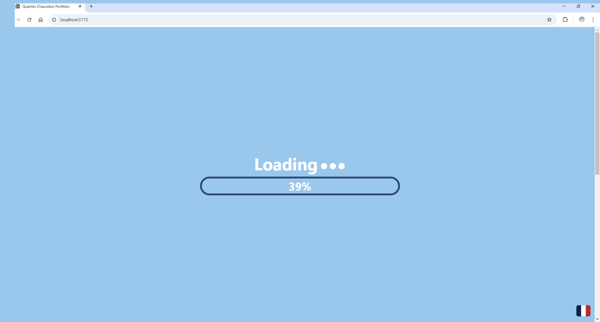

# Portfolio Web 3D

Code source de mon [portfolio](https://quentinchauvelon.com/).

Comme je ne souhaitais pas faire un site statique et après avoir vu quelques portfolios 3D, j'ai décidé de créer le mien. Chaque section de ce portfolio (éducation, expérience, projets...) est représenté par un object cliquable dans une scène 3D dans votre navigateur.

Ce projet utilise React, TypeScript et Tailwind CSS. Il m'a permis d'améliorer mes compétences en développement web ainsi que de découvrir de nouvelles technologies telles que les rendus 3D dans un navigateur en utilisant React Three Fiber (un moteur de rendu React pour Three.js) ainsi nouveaux frameworks/librairies comme Tailwind CSS ou Framer Motion.

# Screenshots

  
*Page d'accueil*

  
*Bureau*

  
*Objets cliquables*

# Contact

Email: [quentin.chauvelon@gmail.com](mailto:quentin.chauvelon@gmail.com)

Linkedin: [Quentin Chauvelon](https://www.linkedin.com/in/quentin-chauvelon/)
