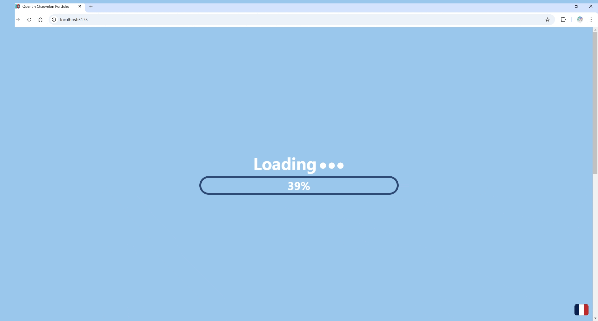
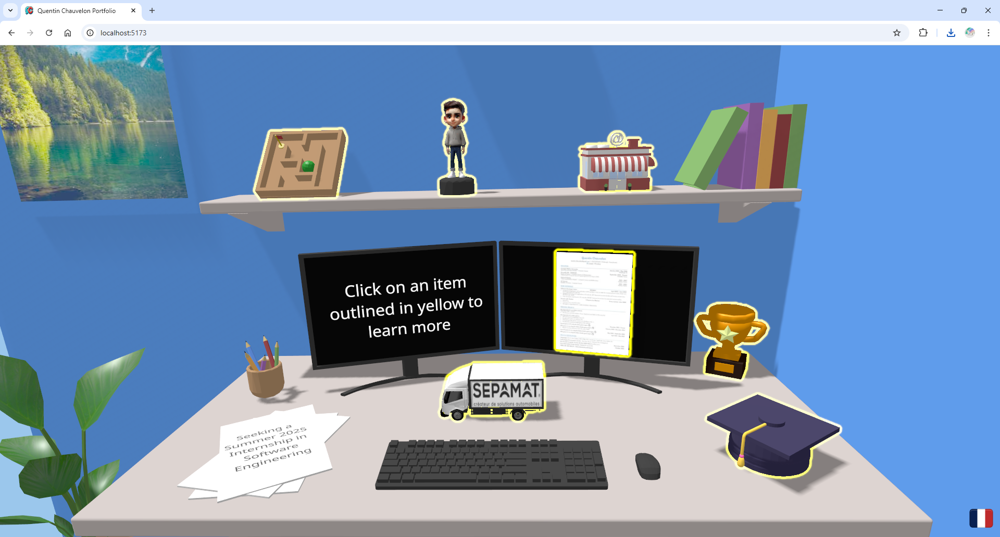

# 3D Portfolio Website

Source code for my [portfolio](https://quentinchauvelon.com/).

Since I didn't want to make a static website and after seeing other 3D portfolios, I decided to make my own. Each section of this portfolio (education, experience, projects...) comes in the form of an interactable item in a 3D scene right in your browser.

This project uses React, TypeScript and Tailwind CSS. It allowed me to improve my web development skills as well as learn new technologies such as 3D rendering in the browser using React Three Fiber (a React renderer for Three.js) and frameworks/libraries like Tailwind CSS or Framer Motion. It also required 3D modeling which was interesting.

# Screenshots

  
*Hero section*

  
*Desk*

  
*Interactive items*

# Contact

Email: [quentin.chauvelon@gmail.com](mailto:quentin.chauvelon@gmail.com)

Linkedin: [Quentin Chauvelon](https://www.linkedin.com/in/quentin-chauvelon/)
